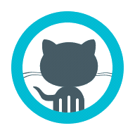

<h1 align="center">Its 'MD' <!------>   Mohammad Danish</h1>
<h3 align="center">Jav developer | I make servers hum and data behave 🛠️📊</h3>

  

---

### 🧑‍💻 About Me

<!-- - 🔭 Currently building: ****
- 🌱 Currently learning: **Micrervices, Kafka**
- 🎯 2026 goal: **** -->
- 💬 Ask me about: **APIs, databases, ETL/ELT, cloud infra**
- ⚡ Fun fact: **Coding Nothing**
- 📫 Reach me: **[mohddanish8299@gmail.com]**

---

### 🧰 My Toolbox

  
  
  
  

  
  
  
  

  
  
  
  

  
  
  
  
  

---

### 📊 GitHub Stats

  
  

  

---

### 🚀 Featured Projects

| Project | What it does | Stack |
|---|---|---|
| 🗂️ **[Kuber Group](https://github.com/KuberGroup/Kuber-Web)** | Just a chat app from basics | React, Firebase |
---

### 🌐 Let's Connect

  
  
  <!---->

  <i>🐛 "It's not a bug, it's an undocumented feature" — probably me, at 2am, debugging a data pipeline 🌙</i>

